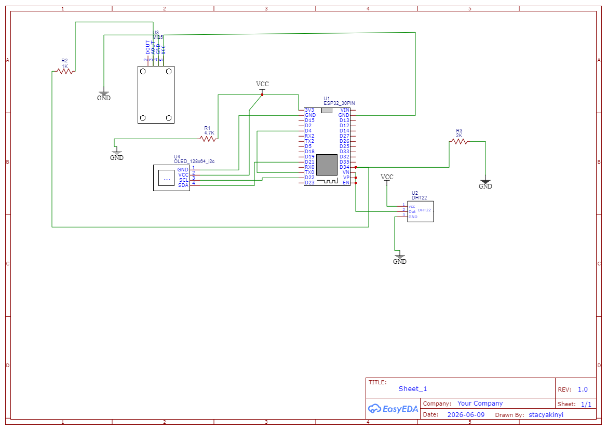
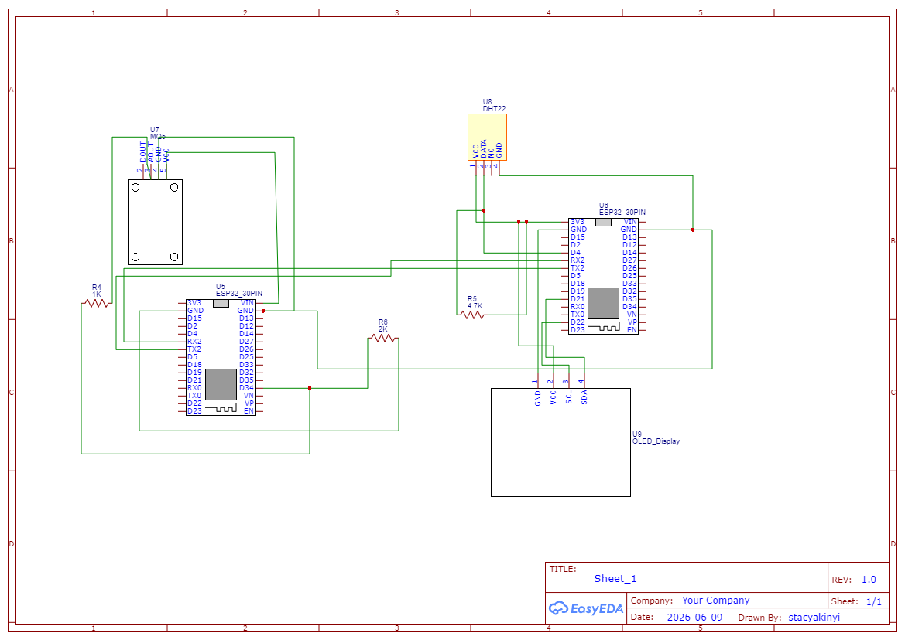
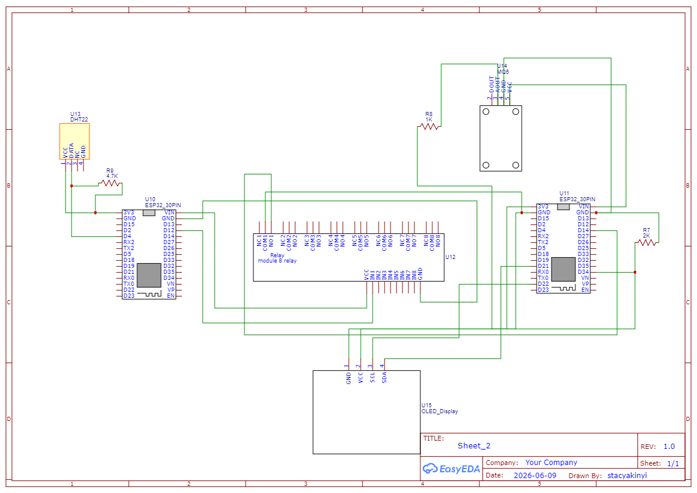
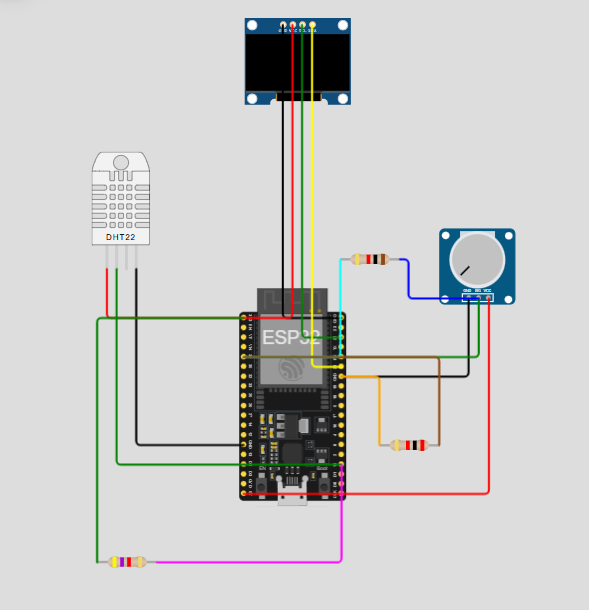

# ICS4111: Embedded Systems & IoT - Greenhouse-IoTProject
## Semester Project: Deliverable 1

* **Course Cycle:** April - July 2026
* **Location Reference:** Flora Farms Greenhouses, Naivasha
* **Assigned Flower Type:** Carnations (*Dianthus caryophyllus*)
* **Group Identification:** Cache Me Outside
* **Group Members:**
  1. Akinyi Stacy 168327 
  2. Savayi Chelsea 150765
  3. Gitahi Mathenge Maribei 166078
  4. Ivan Gichana Angwenyi 153131
  5. Njuru Nick Mugo 166915
  6. James Muthama 141628
 

## 1. Environmental Requirements for Carnation Growth

The table below documents the researched baseline characteristics required to optimize carnation growth in Flora Farms' controlled greenhouse environments:

| Metric | Optimal Range / Value | Characteristics & System Implications |
| :--- | :--- | :--- |
| **a. Optimal Temperature Range** | 18°C - 24°C (Daytime) 10°C - 15°C (Nighttime) | Carnations are highly sensitive to temperature. If temperatures rise above 25°C, bud formation stops. Rapid fluctuations can cause calyx splitting. |
| **b. Optimal Relative Humidity Range** | 60% - 70% (Full Growth) 80% - 85% (Initial establishment) | High relative humidity combined with heat triggers fungal diseases like rust and leaf stains, while dry conditions lead to brittle stems. |
| **c. Recommended Soil Type** | Rich Sandy Loam / Loamy Sand | Carnation roots go 25 to 30 cm deep and are highly susceptible to poor drainage. Soil must be porous and well-aerated. |
| **d. Optimal Soil Moisture Content** | Water holding capacity of 60% - 65% | Irrigation should be supplied via micro-drip networks frequently but in small quantities to prevent waterlogging and root rot. |
| **e. Optimal Soil pH Range** | 5.5 - 6.5 | Soil pH beyond 7.0 locks up essential nutrients like iron, while a low pH diminishes soil microbial life. |
| **f. Sunlight Exposure Hours** | 13 hours (Critical Photoperiod) | Carnations are facultative long-day plants. They require a minimum of 6 hours of full light and benefit from long daylight periods to enhance stem rigidity and flower size. |

> **LPG Monitoring Note:** The greenhouse relies on an LPG heating system to keep nighttime temperatures within the optimal 10°C - 15°C window. The embedded system uses the MQ-5 sensor to continuously monitor air composition for accidental leaks of methane, butane, or propane to preserve crops and safe operations.

---

## 2. Prototyping Hardware Component List & Datasheet Links

To monitor the criteria above and handle the greenhouse environment safely, the following hardware bill of materials is designated for prototyping:

* **Microcontroller:** [ESP32S DevKIT WiFi + BLE Module (30-Pin)](https://www.espressif.com/sites/default/files/documentation/esp32-wroom-32_datasheet_en.pdf)
  * *Role:* Acts as the core microcontroller edge node. It reads sensor data, drives the display and manages communication over the greenhouse WiFi router.
* **Display:** [1.3" White IIC 128X64 OLED LCD](https://www.adafruit.com/product/938)
  * *Role:* Provides local telemetry visualization inside the greenhouse for field operators.
* **Climate Sensor:** [DHT22 AM2302 Temperature and Humidity sensor](https://www.sparkfun.com/datasheets/Sensors/Temperature/DHT22.pdf)
  * *Role:* Measures ambient temperature and relative humidity levels inside the greenhouse canopy.
* **Gas Sensor:** [MQ-5 LPG, Natural Gas, and Coal Gas Sensor](https://www.sparkfun.com/datasheets/Sensors/Biometrics/MQ-5.pdf)
  * *Role:* Detects traces of LPG leaked from the greenhouse's space heaters.
* **Actuator Control:** [5V 1-Channel Low Level Trigger Relay Module](https://www.songle.com)
  * *Role:* Operates as an electronic switch to control automated equipment like fans or heaters.
* **Prototyping Accessories:** Full-sized breadboards, male-to-male/male-to-female jumper wires, pull-up resistors for the I2C bus lines and a voltage divider network (1kΩ and 2kΩ resistors) to drop the MQ-5's 5V analog signal output safely down to the ESP32's 3.3V ADC tolerance.

---

## 3. Architecture Schematic Designs

*Note: The images below reference the circuit schematics uploaded to our project files.*

### Architecture A: Single-Node Multi-Sensor Topography
* **Description:** A standalone master node configuration. One single ESP32S reads telemetry data from both the MQ-5 Gas Sensor (via a voltage divider into an analog pin) and the DHT22 (via a digital pin with a 4.7kΩ pull-up resistor) while directly updating the local 1.3" OLED via an I2C interface (SDA/SCL pins).
* **Circuit Diagram:** 

### Architecture B: Interfaced Dual-Node Topography
* **Description:** Distributed processing configuration. One ESP32S functions as a dedicated safety node monitoring the MQ-5 sensor. It directly interfaces with a second standalone ESP32S node that reads the DHT22 climate sensor using standard serial UART communication protocols (TX to RX, RX to TX, common Ground).
* **Circuit Diagram:** 

### Architecture C: Relay-Isolated Dual-Node Topography
* **Description:** Hardware-isolated signaling configuration. One ESP32S samples the ambient climate using the DHT22 sensor. If parameters fall outside of threshold parameters, it changes the state of a 5V Low-Level Trigger Relay. The relay contacts close an input pin loop on a secondary ESP32S node which is actively handling gas safety with the MQ-5 sensor.
* **Circuit Diagram:** 

---

## 4. Evidence of Groupwork

* **Discussion Date:** June 9, 2026
* **Discussion Summary & Task Distribution:**
  * **Member 1 - Stacy:** Setup the team's GitHub repository, formatted and managed the Markdown document compilation.
  * **Member 2 - Savayi:** Sourced component datasheets and calculated necessary resistor values for our logic safety matching.
  * **Member 3 - Mathenge:** Drafted and exported the circuit schematic for Architecture A.
  * **Member 4 - Nick:** Drafted and exported the circuit schematic for Architecture B.
  * **Member 5 - Ivan:** Drafted and exported the circuit schematic for Architecture C.
  * **Member 6 - James:** Compiled agricultural data regarding Carnation micro-climates and soil parameters.

### Team Evidence Artifact

## Semester Project: Deliverable 2
## 1. Project Implementation Overview
This deliverable details the firmware logic, sensor integration, and communication protocols implemented for the greenhouse monitoring system.

## 2. Firmware Implementation & Logic Flow

* **Sensor Data Acquisition:** Logic implemented for reading DHT22 (temperature/humidity) and MQ-5 (analog gas concentrations).
* **Voltage Divider Calibration:** Software-side scaling for the MQ-5 sensor readings mapped to the 3.3V ADC range of the ESP32.
* **Control Logic:** Implementation of threshold-based triggers for the 5V Relay based on climate and safety requirements.

## 3. System Modelling & Prototyping
#### Architecture A Circuit Simulation
**Simulation Screenshot:** 

**Simulation Link:** [Click here to view interactive simulation](http://wokwi.com/projects/467078195158333441)
#### Architecture A Physical Prototype
- **Hardware Setup:** 
#### Architecture B Physical Prototype
- **Hardware Setup:** 
#### Architecture C Circuit Simulation
**Simulation Screenshot:** 

**Simulation Link:** [Click here to view interactive simulation](http://wokwi.com/projects/467078195158333441)

## 4. Code Implementation
### This is the code to run Architecture A

#include <Wire.h>
#include <Adafruit_GFX.h>
#include <Adafruit_SSD1306.h>
#include <DHT.h>

#define SCREEN_WIDTH 128
#define SCREEN_HEIGHT 64
Adafruit_SSD1306 display(SCREEN_WIDTH, SCREEN_HEIGHT, &Wire, -1);

#define DHTPIN 15
#define DHTTYPE DHT22
DHT dht(DHTPIN, DHTTYPE);

#define MQ5_ANALOG_PIN 34

void setup() {
  Serial.begin(115200); 
  dht.begin();

  if(!display.begin(SSD1306_SWITCHCAPVCC, 0x3C)) { 
    Serial.println(F("SSD1306 allocation failed"));
    for(;;);
  }
  
  display.clearDisplay();
  display.setTextColor(SSD1306_WHITE);
  display.setTextSize(1);
}

void loop() {
  float humidity = dht.readHumidity();
  float temperature = dht.readTemperature();
  int rawGasValue = analogRead(MQ5_ANALOG_PIN); 

  // Output to Serial Monitor for testing 
  Serial.print("Temp: "); Serial.print(temperature);
  Serial.print(" C | Hum: "); Serial.print(humidity);
  Serial.print(" % | Gas Raw: "); Serial.println(rawGasValue);

  // Output to local OLED display screen
  display.clearDisplay();
  display.setCursor(0, 0);
  display.println("GREENHOUSE MONITOR");
  display.println("-------------------");
  display.print("Temp: "); display.print(temperature); display.println(" C");
  display.print("Hum:  "); display.print(humidity); display.println(" %");
  display.print("Gas:  "); display.print(rawGasValue);
  display.display();

  delay(2000); 
}
### This is the code to run Architecture C
